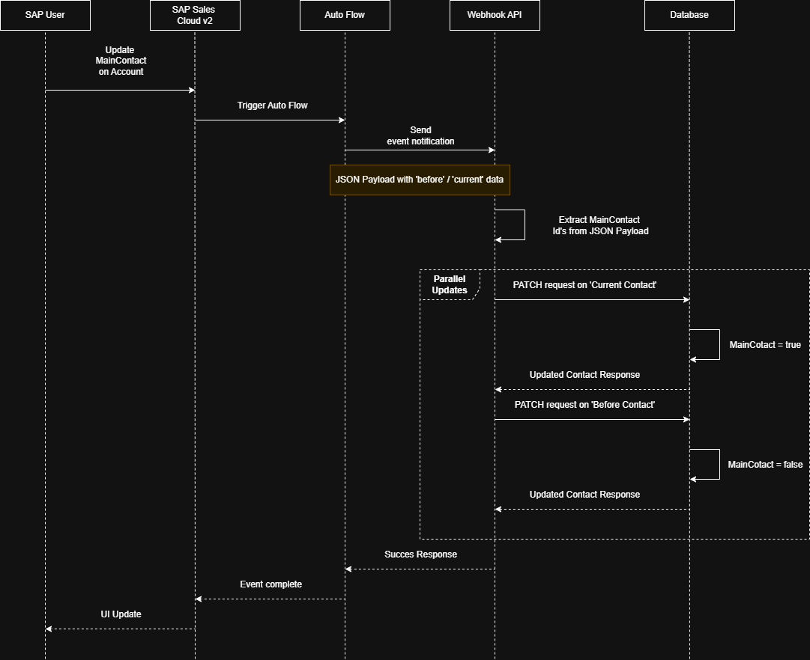

# MainContact Webhook Documentation

## Overview

The MainContact webhook automatically updates the `MainContact` field of Contact entities in Sales Cloud v2 when they are assigned as the primary contact of an Account. This documentation covers the technical implementation, configuration, and usage of the webhook.

## SAP Sales Cloud v2 Integration

### Auto Flow Payload

The webhook receives data from an SAP Sales Cloud v2 auto flow. This automated flow triggers when changes are made to Account entities and sends a payload containing both the current and previous state of the Account.

```
{
    "data": {
        "currentImage": {
            "primaryContactId": "contact123",
            // Other Account fields...
        },
        "beforeImage": {
            "primaryContactId": "contact456",
            // Previous Account state...
        }
    }
}
```

The webhook specifically processes:

- `currentImage.primaryContactId`: The ID of the newly assigned primary contact
- `beforeImage.primaryContactId`: The ID of the previous primary contact

## Technical Architecture

### Components

#### 1. SAP Sales Cloud v2

- Core platform with event-driven communication via Auto Flow
- REST APIs for contact and account management
- Native webhook integration capabilities

#### 2. SAP BTP Application

- Node.js application with NestJS framework
- Deployed on Cloud Foundry runtime
- Event processing and contact updates
- REST API communication

### Integration Flow

This sequence diagram illustrates the complete flow of the MainContact webhook process:



## Implementation Details

### 1. Webhook Handler

The webhook handler (`AccountController`) is exposed at the `/account` endpoint and processes incoming POST notifications from SAP Sales Cloud v2's Auto Flow. When it receives a payload containing account changes, it extracts both the current and previous contact IDs from the `data.currentImage.primaryContactId` and `data.beforeImage.primaryContactId` fields, then initiates parallel updates for efficient processing.

### 2. Contact Service

The contact service (`ContactService`) implements a `updateContactMainStatus` method that handles the data modifications through SAP's OData APIs. It uses the `ContactPersonApi.readcontactpersonserviceContactperson` and `ContactPersonApi.partialupdatecontactpersonserviceContactperson` endpoints for contact operations.

### Error Handling

The application uses NestJS's built-in exception handling with custom HTTP exceptions. Common error scenarios include:

- 404: Contact not found
- 412: Precondition Failed
- 500: Internal server or API communication errors

### Monitoring & Logging

- Application logging through BTP Application Logging service
- Performance metrics via BTP monitoring
- Error tracking and alerting
- Request tracing for debugging

## Security Implementation

### Authentication & Authorization

The application uses SAP BTP's Destination Service for secure credential management and authentication. All credentials and certificates are centrally managed through the BTP Cockpit, ensuring sensitive data never appears in application code.

### Data Protection

- Optimistic locking using `If-Match` headers prevents concurrent modifications
- PATCH requests use `application/merge-patch+json` for partial updates
- All sensitive data handled through SAP's secure communication channels
- Request validation ensures payload integrity

## Testing

The application uses Jest as the testing framework with NestJS's built-in testing module. Our testing approach focuses on isolated unit tests for each component:

### Testins Setup

- Use `@nestjs/testing` TestingModule for component initialization
- Mock external dependencies (ContactPersonApi, AccountApi)
- Use Jest's mock functions to control behavior and verify calls

### Test Coverage

#### 1. AccountController Tests

- Webhook payload processing
- Contact service interaction
- Error handling scenarios
- Missing data handling

#### 2. ContactService Tests

- Main contact updates (true/false)
- API communication
- Error scenarios
- Optimistic locking

#### 3. AccountService Tests

- Account retrieval functionality
- API error handling
- Response processing

### Test cases

Each component includes tests for:

- Happy path scenarios
- Error handling
- Edge cases (empty/invalid IDs)
- API interaction verification

## Infrastructure

### Deployment Environment

The application is deployed on SAP Business Technology Platform (BTP) with a trail subaccount using:

- Runtime: Cloud Foundry Node.js buildpack
- Memory: 128MB per instance
- Instances: 3 (horizontally scaled)
- Region: US10 (United States)

## Development Setup

### Prerequisites

- Node.js & npm
- SAP BTP Cloud Foundry
- SSCV2 environment
- Configured destinations

### Installation

1. Clone repository
2. Install dependencies:

```
npm install
```

3. Configure environment:
The `DESTINATION_NAME` wil be the name of your destination you want to use in BTP.

```
DESTINATION_NAME=your_destination
```

4. Deploy:

```
cf push
```
